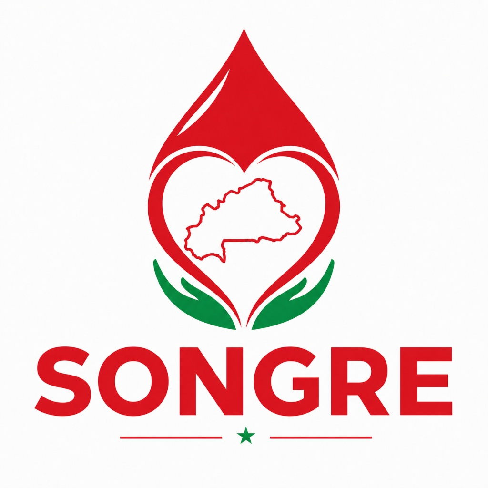

# SONGRE — Plateforme de Don de Sang | Blood Donation Platform

<p align="center">
  
</p>

## Vue d'ensemble | Overview

**SONGRE** (du Mooré : "sang" / "blood") est une plateforme numérique à but non lucratif qui connecte les donneurs de sang bénévoles avec les patients au Burkina Faso. Anonyme, sécurisée, disponible 24h/24.

**SONGRE** is a non-profit digital platform connecting voluntary blood donors with patients in Burkina Faso. Anonymous, secure, available 24/7.

---

## URLs de démo | Demo URLs

| Environnement | URL |
|---|---|
| Live (Sandbox) | https://3000-ixd75c2k96mkgvj0d0g88-ea026bf9.sandbox.novita.ai |
| Page FR Home | `/fr` |
| Page EN Home | `/en` |
| API Health | `/api/health` |
| Sitemap | `/sitemap.xml` |
| LLMs.txt | `/llms.txt` |

---

## Structure des Pages | Page Structure

### 🇫🇷 Français
| Route | Description |
|---|---|
| `/fr` | Accueil (Landing Page Hero) |
| `/fr/a-propos` | Mission & Équipe |
| `/fr/securite` | Anonymat & Sécurité AES-256 |
| `/fr/faq` | 20 questions/réponses |
| `/fr/contact` | Formulaire de contact |
| `/fr/cgu` | Conditions Générales d'Utilisation |
| `/fr/confidentialite` | Politique de Confidentialité |

### 🇬🇧 English
| Route | Description |
|---|---|
| `/en` | Home (Landing Page) |
| `/en/about` | Mission & Team |
| `/en/security` | Anonymity & AES-256 Security |
| `/en/faq` | 20 Q&As |
| `/en/contact` | Contact form |
| `/en/terms` | Terms of Service |
| `/en/privacy` | Privacy Policy |

---

## Architecture Technique | Technical Architecture

### Stack
- **Backend**: Hono v4 (TypeScript) — Cloudflare Workers/Pages
- **Frontend**: Vanilla JS + CSS Custom Properties
- **Fonts**: Lora (Serif, titres) + Inter (Sans, corps)
- **Build**: Vite + @hono/vite-build
- **Runtime**: Cloudflare Pages Edge

### Sécurité | Security
- ✅ Rate Limiting (60 req/min global, 5 req/min /api/contact)
- ✅ CORS strict (domaines autorisés uniquement)
- ✅ Security Headers (CSP, HSTS, X-Frame-Options, etc.)
- ✅ Input validation côté serveur
- ✅ GDPR consent obligatoire sur le formulaire

### SEO
- ✅ Titres et descriptions uniques par page et par langue
- ✅ OpenGraph + Twitter Cards
- ✅ JSON-LD (Organization, FAQPage schemas)
- ✅ Sitemap XML dynamique
- ✅ robots.txt configuré
- ✅ llms.txt pour les IA
- ✅ hreflang FR/EN
- ✅ Canonical URLs

### i18n
- Détection automatique de langue (Accept-Language header)
- Routage `/fr/*` et `/en/*`
- Traductions complètes FR et EN
- Redirects legacy configurés

---

## Fonctionnalités Implémentées

### ✅ Complétées
- [x] 7 pages × 2 langues = 14 pages au total
- [x] Design System complet (CSS variables, composants)
- [x] Animations scroll reveal + count-up
- [x] FAQ accordion avec filtre par catégorie
- [x] Formulaire contact avec Formspree
- [x] Mobile-first responsive
- [x] Navbar sticky avec menu mobile
- [x] Footer complet avec réseaux sociaux
- [x] Phone mockup animé dans le hero
- [x] Statistiques d'impact avec animation
- [x] Témoignages utilisateurs
- [x] Couverture géographique Burkina Faso
- [x] Maquettes de téléchargement iOS/Android
- [x] Architecture sécurité Schema v3 visualisée
- [x] CGU et Politique de Confidentialité complètes
- [x] JSON-LD FAQPage pour rich snippets Google
- [x] Manifest PWA
- [x] llms.txt pour les LLMs
- [x] _headers et _redirects Cloudflare Pages

### 🔮 Recommandations suivantes
- [ ] Intégrer vraie image OG (1200×630px)
- [ ] Configurer Formspree avec le vrai ID de projet
- [ ] Déployer sur Cloudflare Pages (voir skill cf-byok-deploy)
- [ ] Ajouter Google Analytics 4 (sans cookies)
- [ ] Créer un blog/actualités pour le SEO long-tail
- [ ] Ajouter la carte interactive des centres de collecte

---

## Données & Modèle | Data Model

```
Donor Profile (Anonymous):
  - blood_type: 'A+' | 'A-' | 'B+' | 'B-' | 'AB+' | 'AB-' | 'O+' | 'O-'
  - city: string (approximate)
  - available: boolean
  - last_donation: timestamp
  [stored anonymized in Database B]

Contact Info (Encrypted):
  - phone_hash | email_hash
  [stored AES-256 encrypted in Database A, physically separate]
```

---

## Déploiement | Deployment

```bash
# Build
npm run build

# Dev local (PM2)
pm2 start ecosystem.config.cjs

# Deploy Cloudflare Pages
npm run deploy
```

---

## Configuration

- **Formspree**: Remplacer l'endpoint dans `src/routes/contact.ts`
- **Base URL**: Mettre à jour `https://songre.bf` dans `src/utils/seo.ts`
- **Cloudflare Project**: Configurer `wrangler.jsonc` avec le bon project name

---

## Contact

- **Email**: songre.contact@gmail.com
- **Localisation**: Ouagadougou, Burkina Faso 🇧🇫
- **Plateforme**: Cloudflare Pages Edge Network

---

*© 2024 SONGRE. Tous droits réservés. Fait avec ❤️ au Burkina Faso.*
